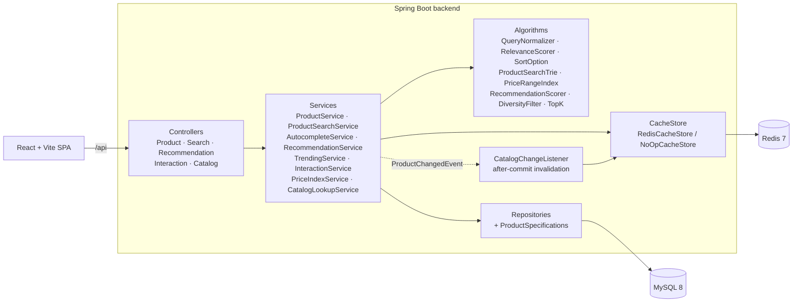

# Architecture

QuickFind is a **modular monolith**: one Spring Boot service with strict layers, MySQL as the source of truth, Redis as an optional cache, and a React single-page app.

## Request flow

```
Browser (React SPA)
  │  /api/...            (Vite dev proxy, or nginx in Docker; same origin, no CORS needed)
  ▼
RequestLoggingFilter      request id (MDC + X-Request-Id), one log line per request
  ▼
Controller                binds HTTP params/body to DTOs, @Valid; no business logic
  ▼
Service                   validation of meaning, orchestration, transactions, cache-aside
  ├──► search / recommendation / util   pure-Java algorithms (no Spring, no JPA)
  ├──► CacheStore (Redis)               fail-open: an error is a cache miss
  └──► Repository (Spring Data JPA)     Criteria specifications, JPQL, one native query
          ▼
        MySQL 8 (schema owned by Flyway)
  ▲
Mapper                    entity → response DTO (entities never leave the service layer)
GlobalExceptionHandler    any exception → the same JSON error shape, no stack traces
```

## Component diagram



## Packages (`backend/src/main/java/com/quickfind`)

| Package | Responsibility |
|---|---|
| `controller` | REST endpoints. Translate HTTP to service calls and back. |
| `service` | Use cases, transactions, cache-aside, validation that needs the database. |
| `search` | Query normalisation, relevance scoring, sort comparators, autocomplete Trie, price index. Plain Java. |
| `recommendation` | Recommendation formula, category relations, diversity filter. Plain Java. |
| `cache` | `CacheStore` abstraction, Redis implementation, key naming and versioning. |
| `repository` | Spring Data JPA repositories, projections, `ProductSpecifications` (Criteria API). |
| `entity` | JPA entities. |
| `dto` | Request/response records. |
| `mapper` | Entity → DTO and entity → algorithm-input conversion. |
| `exception` | Error codes, custom exceptions, `@RestControllerAdvice`. |
| `config` | Typed properties, CORS, request logging, algorithm beans, scheduling. |
| `seed` | Demo catalog loader and the bulk data generator used for benchmarks. |
| `util` | `TopK` (bounded heap), size ordering, text helpers. |

`search`, `recommendation` and `util` have no Spring or JPA imports. They receive plain records (`SearchDocument`, `RecommendationCandidate`), so their unit tests run in milliseconds without a Spring context.

## Where search logic lives

Work is split between the database and Java on purpose:

- **MySQL narrows.** Structured filters (category, brand, price, rating, stock) become indexed `WHERE` clauses. Text tokens become a broad `LIKE '%token%'` match over name, description, brand, subcategory, parent category and color names. At most `quickfind.search.candidate-limit` (2,000) candidates come back, most popular first.
- **Java decides.** `RelevanceScorer` scores each candidate with an explainable formula (see [DSA.md](DSA.md)). Non-matches are dropped, a `Comparator` sorts the rest, and the requested page is cut out.
- **No text query** means no scoring is needed, so filtering, sorting and pagination all happen in SQL.

The trade-off: a query matching more than 2,000 products is ranked among its 2,000 most popular matches, and the response says so (`candidatesTruncated: true`). At a larger scale this job moves to an inverted-index engine (Elasticsearch/OpenSearch with BM25). Here the ranking logic stays visible and unit-testable.

## Caching (Redis)

The pattern is cache-aside. Every key has a TTL, and all values are JSON.

| Key | Contents | TTL | Invalidation |
|---|---|---|---|
| `product:{id}` | Product detail DTO | 30 min | Deleted after a create/update/stock change/delete **commits** |
| `suggest:v{n}:{limit}:{prefix}` | Autocomplete response | 10 min | `suggest:version` is incremented after every Trie rebuild |
| `reco:v{n}:{productId}:{userId}:{limit}` | Recommendations | 10 min | `catalog:version` is incremented on every product change |
| `trending:v{n}:{limit}` | Trending products | 5 min | `catalog:version`, plus the TTL for new interactions |
| Search results | not cached | – | Filter combinations make the hit rate low; see PERFORMANCE.md |

Design points:

- **Why versioned keys?** Renaming one product changes the suggestions for every prefix of its old and new name, and changes other products' recommendations. Deleting those keys means SCAN/KEYS over the keyspace and the risk of missing one. Bumping a version counter makes every old key unreachable in O(1); the old entries expire through their TTL.
- **Why evict after commit?** If the key were evicted before the transaction commits, a concurrent reader could load the old row and put it back into Redis. `CatalogChangeListener` is a `@TransactionalEventListener`, which runs after commit.
- **Fail-open.** `RedisCacheStore` catches every Redis error, treats it as a miss, and skips Redis for 30 s (`failure-backoff`), so an outage costs one timeout rather than one per request. Hits, misses and errors are counted in the Micrometer metric `quickfind.cache.requests` (`/actuator/metrics/quickfind.cache.requests`).
- **Accepted staleness.** Interactions increase `popularity_score` with an atomic SQL update but do not evict the cached product detail. Popularity can be up to 30 minutes stale on the detail page, which avoids invalidating the cache on every page view.
- Tests and the `h2` profile use `NoOpCacheStore` (`CACHE_ENABLED=false`).

## In-memory structures and their lifecycle

| Structure | Built from | Rebuilt when |
|---|---|---|
| `ProductSearchTrie` | Product names (top 10,000 by popularity), name phrases, brands, subcategories, popular queries | At startup; about 2 s after a product change (scheduled dirty check); every 5 min for popular queries |
| `PriceRangeIndex` per category | In-stock sale prices | Lazily, on the first facet request after a product change |
| `CatalogLookupService` maps | Brands, categories, colors | At startup / after seeding (reference data has no write API) |

Every rebuild builds a new instance and swaps a `volatile` reference, so readers never lock and never see a half-built structure. Limitation: each backend instance holds its own copy. With several instances, a change is picked up by all of them only through their own scheduled rebuilds. That is fine at this scale; a shared search service would remove it.

## Security (MVP scope)

- There is no login. Requests without `userId` act as the seeded demo user (`DemoUserProvider`, the single place to swap in an authenticated principal).
- Admin operations are exactly the write methods on `/api/products/**`. Adding Spring Security means restricting those to `ROLE_ADMIN`; `users.role` already exists.
- There are no secrets in code: credentials come from environment variables or `.env` (git-ignored).
- Every SQL value is a bound parameter (Criteria API/JPQL). Request bodies are never logged.

## Error handling

`GlobalExceptionHandler` maps every exception to:

```json
{ "timestamp": "...", "status": 400, "error": "INVALID_SORT", "message": "...", "path": "/api/products/search", "fieldErrors": [] }
```

Expected errors (`QuickFindException` subclasses, validation) are logged at WARN without a stack trace. Unexpected ones are logged at ERROR with the trace, which stays in the server log. The full code list is in [API.md](API.md#errors).
