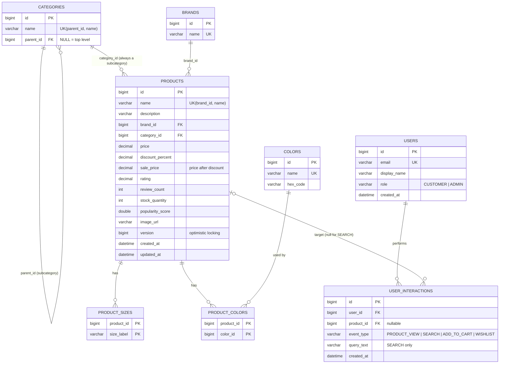

# Database design

MySQL 8. Flyway owns the schema (`backend/src/main/resources/db/migration`), and Hibernate only validates it (`ddl-auto=validate`), so every schema change is a reviewed, versioned SQL file.

| Migration | Contents |
|---|---|
| `V1__init_schema.sql` | Tables, primary keys, foreign keys, unique and CHECK constraints |
| `V2__search_indexes.sql` | Performance indexes, separate so their effect can be benchmarked (`FLYWAY_TARGET=1` skips them) |

The same SQL also runs on H2 in MySQL mode, which the test suite and the zero-setup `h2` profile use. Both migrations were applied to MySQL 8.0 and to H2 2.2 during development. A Testcontainers test (`MySqlIntegrationTest`) runs them against MySQL 8.4 whenever Docker is available.

## ER diagram

## Design decisions

- **Subcategory as a self-referencing category.** "Running Shoes" is a row whose `parent_id` points at "Footwear". Products reference the subcategory only, and the top-level category is derived through `parent_id`. A separate `subcategory` column could disagree with `category`; this design can't. The API rejects a top-level category as a product's `categoryId`.
- **Colors and sizes are normalised.** A product has several colors (a `product_colors` join table onto a `colors` lookup table, which also holds hex codes for the UI) and several sizes (`product_sizes`, an element collection). Filters use `EXISTS` subqueries so a product is returned once even if several colors match.
- **Money is `DECIMAL`, never floating point.** `price` and `sale_price` are `DECIMAL(10,2)`, `discount_percent` is `DECIMAL(5,2)` and `rating` is `DECIMAL(2,1)`. `popularity_score` is a `DOUBLE` because it is a ranking signal, not money.
- **`sale_price` is denormalised on purpose.** Shoppers filter and sort by the price they pay. Computing `price * (1 - discount/100)` in the `WHERE`/`ORDER BY` would make those clauses non-indexable, so the entity recomputes `sale_price` on every insert/update (`@PrePersist`/`@PreUpdate`) and the column is indexed.
- **Optimistic locking.** `products.version` (`@Version`) stops two admins from silently overwriting each other. The API also accepts the client's `version` and returns 409 when it is stale.
- **Integrity in the database, not only in Java.** CHECK constraints guard price > 0, discount 0–90, rating 0–5, and non-negative stock, reviews and popularity (enforced since MySQL 8.0.16). Unique constraints cover emails, brand names, color names, category names per parent, and product names per brand.
- **Cascades only where ownership is clear.** Deleting a product deletes its sizes, color links and interactions (`ON DELETE CASCADE`). Brands, categories, colors and users are never cascaded.
- **Popularity counter updates are atomic SQL** (`UPDATE … SET popularity_score = popularity_score + ?`). There is no read-modify-write and no version bump for a counter.
- **Timestamps are UTC** (`DATETIME(6)`, `LocalDateTime` in UTC, `hibernate.jdbc.time_zone=UTC`).

## Indexes

InnoDB automatically creates an index for every foreign key, so `brand_id`, `category_id`, `parent_id`, `user_id`, `product_id` and `color_id` are indexed from V1 on. It's a common mistake to "add an index on category_id" and credit it for a speed-up that was already there.

**V1 (constraints):**

| Index | Columns | Purpose |
|---|---|---|
| PK | every `id`; `(product_id, size_label)`; `(product_id, color_id)` | identity, join tables |
| `uk_products_brand_name` | `(brand_id, name)` | duplicate check; also serves `brand_id` lookups |
| `uk_users_email`, `uk_brands_name`, `uk_colors_name`, `uk_categories_parent_name` | | uniqueness |

**V2 (performance):**

| Index | Serves |
|---|---|
| `idx_products_category_sale_price (category_id, sale_price)` | Category + price range, category sorted by price |
| `idx_products_brand_sale_price (brand_id, sale_price)` | Brand + price range |
| `idx_products_sale_price`, `idx_products_rating`, `idx_products_popularity` | Unfiltered browsing sorted by price/rating/popularity with `LIMIT`, and search candidates ordered by popularity. Avoids a filesort of the whole table. |
| `idx_interactions_user_created (user_id, created_at)` | Recent activity; a user's recent subcategories |
| `idx_interactions_product_type (product_id, event_type)` | Co-interaction self-join ("who else engaged with product X") |
| `idx_interactions_created (created_at)` | Trending window (`created_at >= now − 7 days`) |

**Deliberately not indexed:**

- Text columns for `LIKE '%token%'`. A leading wildcard cannot use a B-tree index. MySQL `FULLTEXT` was considered but not used: it applies a minimum token length and stopwords, has no prefix matching without boolean mode, and does not run on H2. That would split the test and production behaviour. Candidate retrieval is therefore a scan capped by `LIMIT` and ordered by the popularity index. See [PERFORMANCE.md](PERFORMANCE.md) for how that scales, and the Elasticsearch next step.
- `stock_quantity` on its own. It has low selectivity (most products are in stock), so the optimizer would rarely use it.

`scripts/explain-queries.sql` runs `EXPLAIN ANALYZE` for the main query shapes, so the plans can be compared with and without V2.

## Seed data

- **Demo catalog.** On startup, if `products` is empty, `DataSeeder` inserts 114 hand-written products across 10 subcategories and 32 brands, plus 16 colors, 8 users (the demo shopper, an admin and 6 shoppers) and about 50 interactions. The interactions give trending and co-interaction recommendations some data on first run. The data lives in `seed/CatalogSeedData.java` as plain Java, and a unit test checks every reference in it. Set `SEED_ENABLED=false` to disable.
- **Benchmark data.** `scripts/generate-test-data.(sh|ps1) N` runs the backend with the `generate` profile, which uses JDBC batch inserts (1,000 rows per batch, `rewriteBatchedStatements=true`) to add N deterministic synthetic products.
